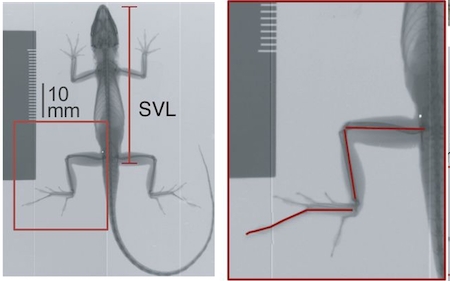

```{r setup, include=FALSE}
knitr::opts_chunk$set(echo = TRUE)
```

## R Markdown

# Header 1
Text under Header 1

## Header 2
Text under Header 2

### Header 3
Text under Header 3

  1. Visualize how hind limb length varies with size (i.e., allometry!).
  2. Visualize and asses how hind limb length vs. size relationship covary with ecological niche.
  3. Learn more complex operations in `ggplot` than we've undertaken so far. 
  4. Evaluate this hindlimb-size relationship using standard frequentist models within and without a phylogenetic context.
  5. Using an information theory approach, assess the fit of phylogenetically corrected models of hind-limb variation under different modes of character evolution.
  

  * Visualize how hind limb length varies with size (i.e., allometry!).
  * Visualize and asses how hind limb length vs. size relationship covary with ecological niche.
  * Learn more complex operations in `ggplot` than we've undertaken so far. 
  * Evaluate this hindlimb-size relationship using standard frequentist models within and without a phylogenetic context.
  * Using an information theory approach, assess the fit of phylogenetically corrected models of hind-limb variation under different modes of character evolution.
  

[class site](https://bcorgbio.github.io/class/)

## Images


[](https://upload.wikimedia.org/wikipedia/commons/thumb/4/4b/Green_anole.jpg/320px-Green_anole.jpg)

<center>
[](https://upload.wikimedia.org/wikipedia/commons/thumb/4/4b/Green_anole.jpg/320px-Green_anole.jpg)
</center>

<center>

</center>

## Equations
$$y=\alpha+\beta x$$

$y=\alpha+\beta x$

```{r}
x <- 1:100
mean(50)
```

## Module 3 Project Code
```{r,include=FALSE}
library(tidyverse) #always
library(ape) #for evo analysis
library(nlme) #ditto
library(MuMIn) #for AIC
library(geiger) #for eco analysis
library(knitr) #for knitting options
```

```{r, "load the data"}
anole <- read_csv("anole.dat.csv")
anole.eco <- read_csv("anole.eco.csv")
anole.tree <- read.tree("anole.tre")
```

```{r, "join, filter, mutate to log"}
anole2 <- anole%>%
  left_join(anole.eco)%>%
  filter(!Ecomorph%in%c("U","CH"))%>%
  na.omit()

anole.log <- anole2%>%
  mutate_at(c("SVL", "HTotal","PH","ArbPD"),log)
```

```{r, "PGLS models"}
### phylogenetic GLS models

#PGLS under BM, no ecomorph
pgls.BM1 <- gls(HTotal ~SVL, correlation = corBrownian(1,phy = anole.tree,form=~Species),data = anole.log, method = "ML")

#PGLS under BM, w ecomorph
pgls.BM2 <- gls(HTotal ~SVL * Ecomorph2, correlation = corBrownian(1,phy = anole.tree,form=~Species),data = anole.log, method = "ML")

#PGLS under OU, no ecomorph
pgls.OU1 <- gls(HTotal ~SVL, correlation = corMartins(0,phy = anole.tree,form=~Species),data = anole.log, method = "ML")

#PGLS under OU, w, ecomorph
pgls.OU2 <- gls(HTotal ~SVL * Ecomorph2, correlation = corMartins(0,phy = anole.tree,form=~Species),data = anole.log, method = "ML")
```

```{r, "AIC"}
#AIC operations
anole.phylo.aic <- AICc(pgls.BM1,pgls.BM2,pgls.OU1,pgls.OU2)
anole.phylow.aicw <- aicw(anole.phylo.aic$AICc)
```

```{r, "add residuals"}
#add phylo-corrected residuals
anole.log <- anole.log%>%
  mutate(phylo.res=residuals(pgls.BM2))
```

```{r,"plot residuals", fig.cap="Boxplot of phylogenetically corrected hindlimb residuals versus anole ecomorph"}
#plot residuals
p.eco.phylo <- anole.log%>%
ggplot(aes(x=Ecomorph2,y=phylo.res)) +geom_boxplot() +stat_summary(fun=mean, geom="point", size=3)

print(p.eco.phylo)

```

## Tables
```{r}
n.spec <- anole.log%>%
  group_by(Ecomorph2)%>%
  summarise(n.species=n())

n.spec%>%
  kable()

n.spec%>%
  kable(caption = "Number of species within each anole ecomorph included in this study")

```

```{r}
library(rmarkdown)
paged_table(anole.log, options = list(rows.print = 15))
```


## Inserting References
@hagey2017there studied the hindlimb-ecomorph relationship in anoles.
A recent study considered the hindlimb-ecomorph relationship in anoles [@hagey2017there].

# Bonus left over Notes
This is an R Markdown document. Markdown is a simple formatting syntax for authoring HTML, PDF, and MS Word documents. For more details on using R Markdown see <http://rmarkdown.rstudio.com>.

When you click the **Knit** button a document will be generated that includes both content as well as the output of any embedded R code chunks within the document. You can embed an R code chunk like this:

```{r cars}
summary(cars)
```

## Including Plots

You can also embed plots, for example:

```{r pressure, echo=FALSE}
plot(pressure)
```

Note that the `echo = FALSE` parameter was added to the code chunk to prevent printing of the R code that generated the plot.

## References
